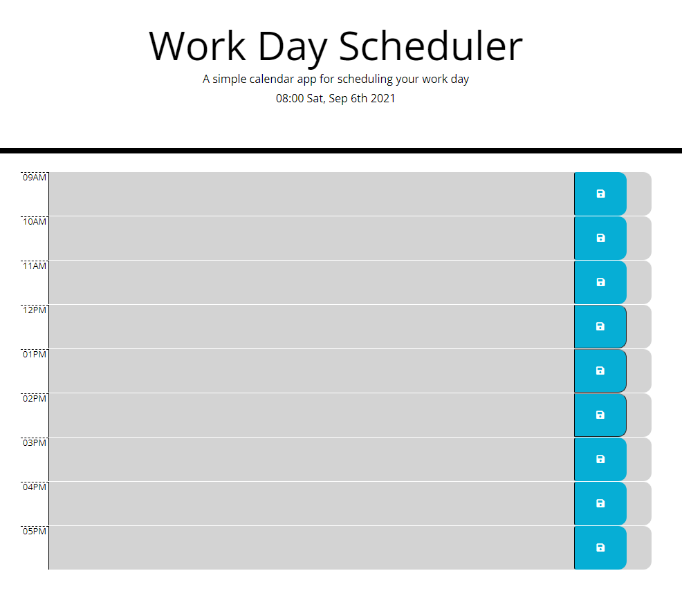

# Day Planner

## Key Features

➕ daily planner to create a schedule

➕ when you open the planner the current day is displayed at the top of the calendar

➕ when you scrolldown you are presented with timeblocks for standard business hours

➕ each timeblock is color coded to indicate whether it is in the past, present, or future

➕ when you click into a timeblock, you can enter an event

➕ If you click the save button for that timeblock then the text for that event is saved in local storage and when you refresh the page the saved events persist

### Link to deployed site https://michaeldigi.github.io/Day-Planner/
